# Sports Expense Tracker 

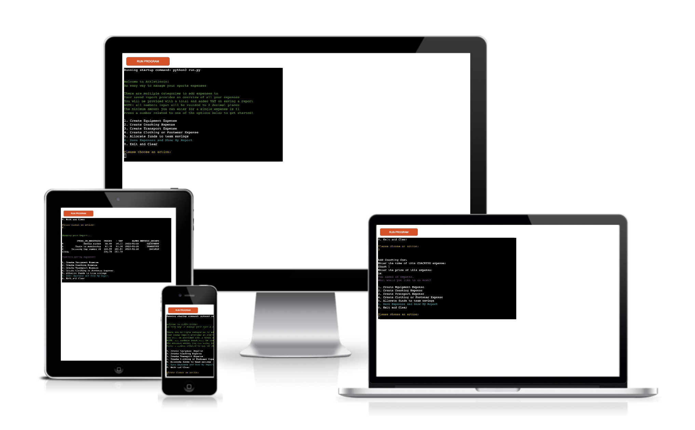

Live application can be found here: https://sport-expense-tracker.herokuapp.com/


This is a command-line-interface application designed for a user to add expenses and savings to specific sport-related categories, and view a full expense report with their data with VAT added. This project has been designed for educational purposes and uses the Code Institute mock terminal to run in the server. 

<hr>

## User Experience 

### Design
- As this is a command-line application there is no design featured which includes custom HTML & CSS. 
- However, I made the decision to import and use the **Colorama** module within my Python code. 
- **Colorama** provides color to terminal text when applied, and I have adopted this to add speicific colours to certain message types in this project. For example, an error message for invalid user input shows as red, the introduction message shows as green text, and the prompts to invite the user to input data are shown as yellow. 
- I chose to do this with Colorama to provide visual structure for the user in the flow of the application when run, and also make messages more readable and aesthetically pleasing. 

### External User's Goals
- As a user, I want to be able to easily add an expense under a specific category for my Sports team or sports needs. 
- As a user, I want to be able to add funds to savings with an assigned reason and price. 
- As a user, I want to be able to save my added expenses and see these in an easily understandable layout with a date included. 
- As a user, I want to be able to see my expense report, with all of the information about each expense that I input and to be able to see VAT added to the price. 
- As a user, I want to be able to continuously add further expenses and savings funds to my report as I am using the program. 


## Features
-----

The features included in this program are listed in the main menu when it is run and they can be seen below:

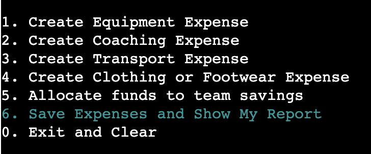

### Introductory Message & Instructions:

- The first information the user is presented with is the introductory message (green text), which explains how to use the expense tracker, how to view your report, and how to exit the program. 
- The introductory message also explains the aim of the app and how it could benefit a sports team. 
- The options to take the first action are also shown, presenting the user with a selection of categories to input an expense or savings fund. 
- There is an input at the bottom for the user to enter a number from the options, which only accepts numbers 0-6.
    - Validation methods and logic for the choices input can be found in the **Testing & Input Validation** section. 

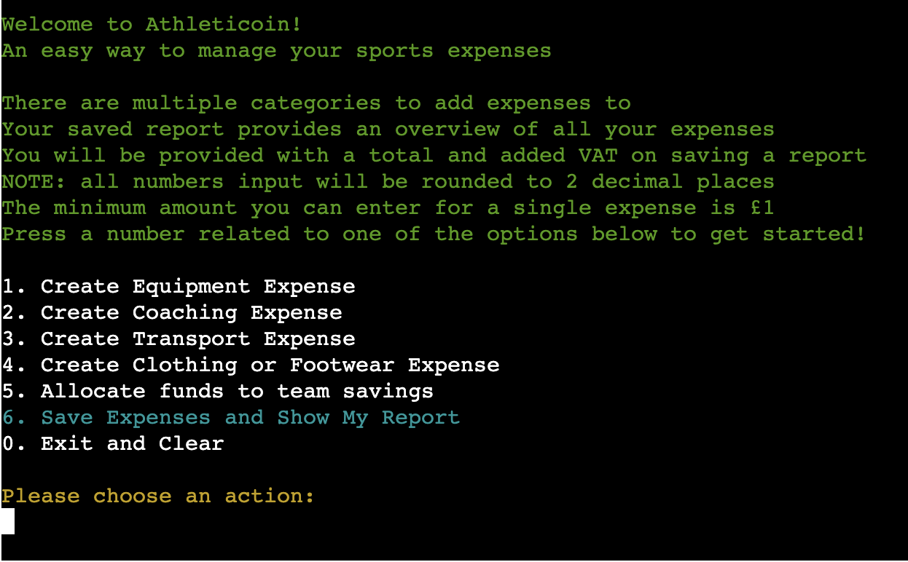

### 1-4 Add Expense:

- Validation methods and logic for the add expense inputs can be found in the **Testing & Input Validation** section. 
- If user inputs number 1,2,3, or 4, they are presented with a message saying that they have selected to enter an expense under the chosen group. 
- The expense categories are: equipment, coaching, transport, and clothing. 

**Expense Name**
- If one of these categories is selected the user can assign a specific name to an expense under the chosen category.
- The name of the expense category selected is repeated back to the user and they are invited to add a name for the expense:
- The user can enter any name they wish for an expense, e.g. 12 Footballs, 1st Team coaching, 22/23 Referees:

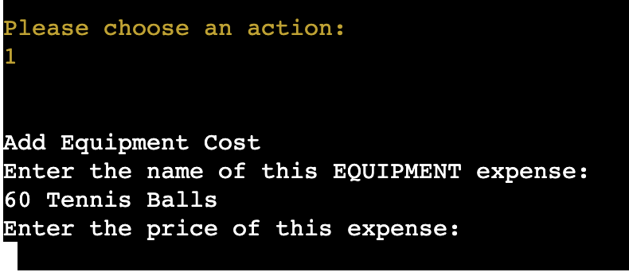

**Expense Price** 
- Once the user has entered a name for the expense, they are then invited to enter a price.
- This must be a number >= 1 and can be to as many decimal places as they wish.
- The instruction to the user that the number must be 1 or above is in the introductory message.
	- This number will automatically be rounded to 2 decimal places when shown in the expense report 
 - Once a valid price has been entered the user is presented with a message saying they entered an expense:

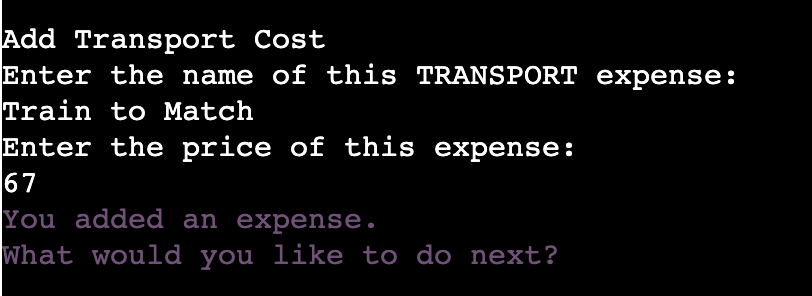

 - The action options are shown again to proceed with adding expenses/savings, or viewing their expense report. This runs continuously until the user enters 0 to exit the program. 

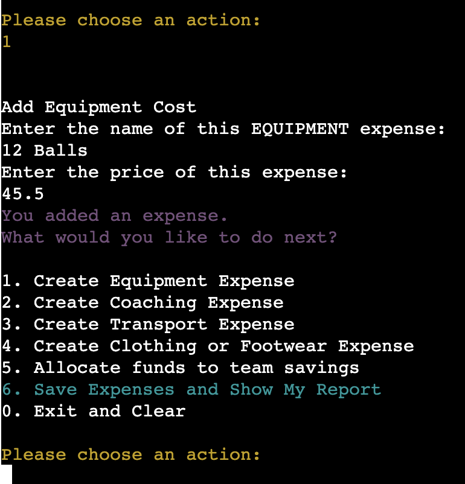


### 5 - Allocate Funds to Savings
- If user inputs number 5 to the 'choices' input, they will presented with a message saying they have chosen to allocate funds to the savings for their Sports Team. 

**Reason for Allocating Funds**
- They are asked to enter a reason for allocating funds to savings. *E.g. Training Camp Flights Oct 2023.*
- This input does not accept empty strings. 
    - Validation methods and logic for the add expense inputs can be found in the **Testing & Input Validation** section. 
    - The user can enter any reason for allocating funds to savings, and the input will accept numbers and characters. This decision was made in line with real-world examples of Sports teams using expense trackers, e.g. they may need to enter numbers or characters into expense/savings reasons, as seen in the example above. 

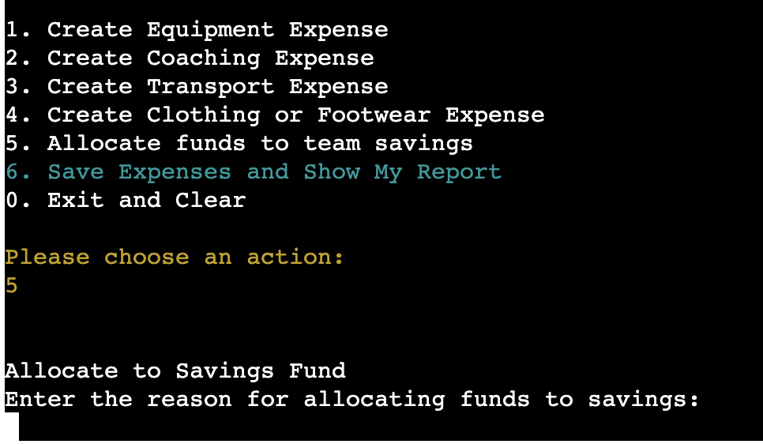

**Add Savings Amount**
- Once a reason for allocating funds to savings has been given, the user is invited to enter a number for the price of this. 
- This input works exactly the same as the **input expense price** input and the functions are almost identical:

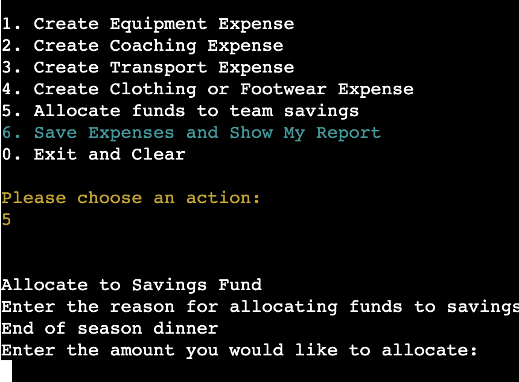

- Once the user has entered an amount to allocate to savings, they are shown a message telling them they have done this, and are presented with the options again to add more expenses/savings, show their report, or exit the program:

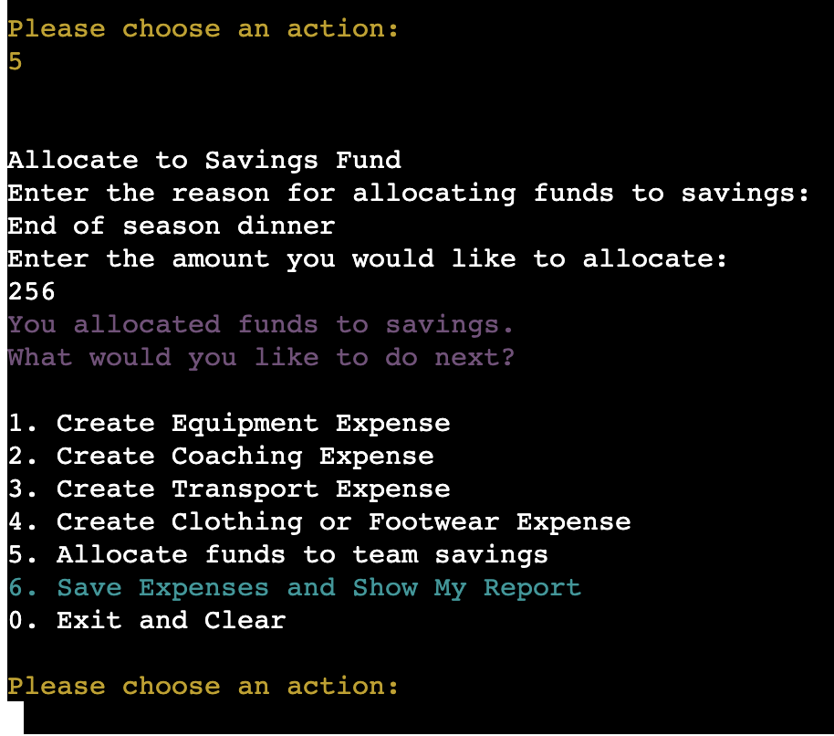

### 6 - Show Report 
- when the user has entered any expense/savings data and then choses number 6 from the choices input menu, they will be presented with a message and their expense report as a pandas data frame. 

- This report is structured as a pandas data frame, and columns include:
    - The name of expense/reason for savings that the user has entered.
    - The price that the user has entered (automatically rounded to 2 decimal places).
    - Each expense price +20% for VAT in a separate column
    - The date each expense was input.
    - The expense group under which each expense was saved. 

- There is also a TOTAL row at the bottom of the data frame, which includes the total of all prices as they were input, and the total of all prices +VAT from the VAT column:

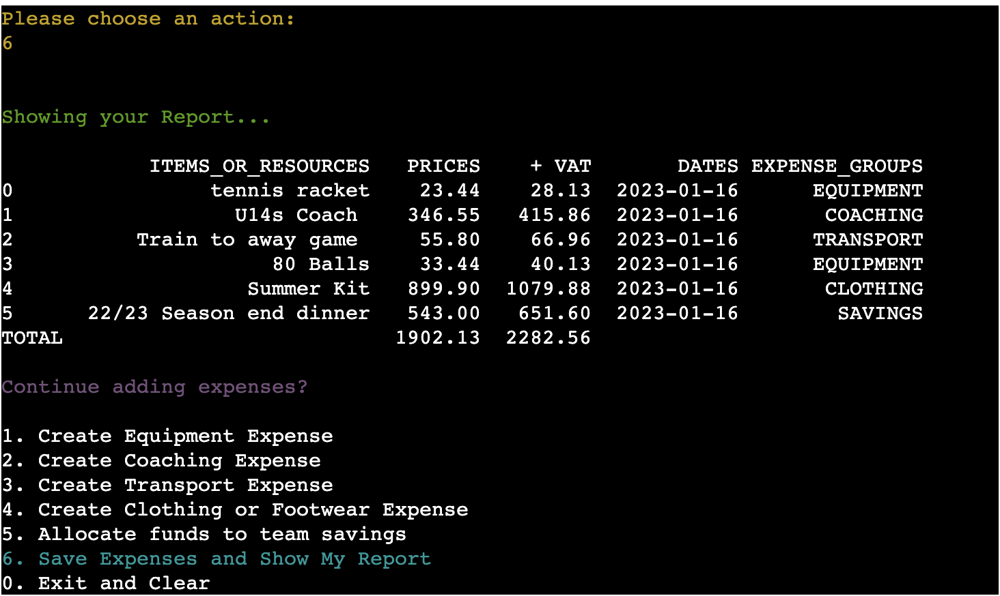


- After showing the report, the user is able to continue to add expenses/savings to their report by continuing with the inputs in previous steps.
- If they do this then elect to show their report again, all current & new expenses will be shown in a new data frame. 
- This runs continuously and the user is able to keep adding expenses/savings, and multiple for each group:

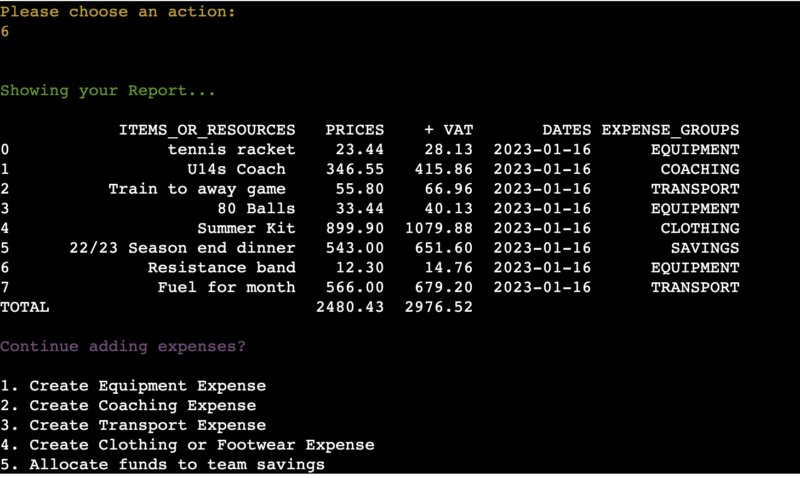

- The user will stop being presented with options once 0 is chosen for the ‘choices’ input to exit the program. 

*Note: if a user chooses 6 on the first input without entering any expense/savings data, and empty Data Frame will show, and they user will be prompted with the options again:*

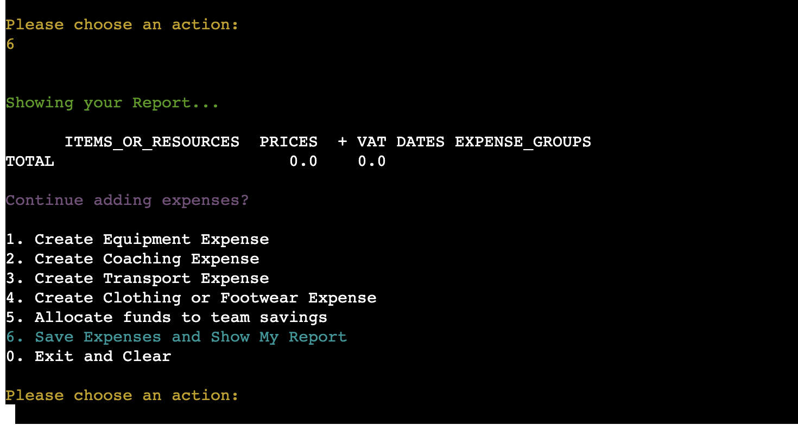


### 0 - Exit and Clear
- When the user enters 0 in choices input, they are presented with a message telling them they are exiting the program. 
- The program will run again if they click 'Run Program' above the mock terminal.

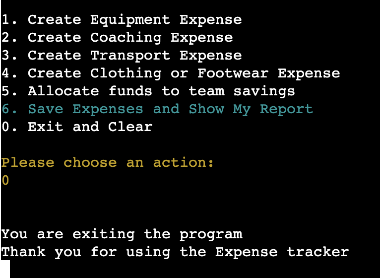

<hr>

## Technologies Used
I have used several technologies to create this program and enable it to run:
* Python
    * Python is the essential programming language in this application to write all of the code and make it fully functional.

**In addition to core Python, I have used the following Python Modules:**

- [Datetime](https://docs.python.org/3/library/datetime.html)
    - Used the *date* import from this module to add the date of each expense to an expense report. 
    - This appends the day to the pandas data frame in the DATE column. 
    - Example syntax in this application: 23-01-16
- [Re - Regular Expression](https://docs.python.org/3/library/re.html)
    - Used to validate price inputs.
    - I use the ‘search’ function to check that an input is: An integer >=1, or a float. 
- [Colorama](https://pypi.org/project/colorama/)
    - Installed and Fore/Style imports used to add and remove color to text in the terminal. 
	- This is for better UX as color points to messaging and structure for the user. 
	- For example, error messages for incorrect input are shown to the user coloured in red.
- [NumPy](https://numpy.org/)
    -  Used to round all numeric values for price in the Pandas expense report to 2 decimal places (standard numeric syntax for prices). 
- [Pandas](https://pandas.pydata.org/)
    -  Pandas was used in this program to create the data frame that presents the expenses report to the user.
    - This creates a table with rows and columns, and appends user input to the data frame depending on the category chosen in the ‘choices’ input. 
    - It also shows a column with a price+VAT calculation and a total row at the bottom. 
    - The Pandas data frame creates an easily understandable visual representation of the users' expenses and allows then to track these over time by presenting in a table format. 

* [GitHub](https://github.com/)
    - Used to store code once it has been pushed.

* Gitpod
    - Used as the development environment.

* [Heroku](https://id.heroku.com/login)
    - Where this project is deployed. 

* [Lucid](https://www.lucidchart.com/pages/)
    - Used to map the flowchart for this project. 

<hr>

## Testing

### Testing & Input Validation

-  I used the ‘External User’s Goals’ outlined above to perform manual testing on the program to see whether all goals and actions for the user could be achieved. 
- All of the User’s Goals can be achieved satisfactorily and this has been tested multiple times in the program by myself and others. 
- Users can use the program without issue or error when the follow the steps and prompts, and the expense report when shown has correct calculations of data input by users. 

### Input Validation
- As this programme relies heavily on users inputting different types of information at various stages, validating these inputs was extremely important at every step to ensure the application can run. 
- I used various methods of validating user input. This is because different inputs in the programme require different types of information to be able to proceed to the next step. 
- All error messages to the user in the program are shown in **red** to allow for clearer messaging and visual structure for the user.  

#### Choices Input 
Upon starting the program, users are presented with a list of actions to take. This list of actions is repeatedly shown to the user unless they choose to exit the program by pressing 0. 
- This input **only** accepts an input of a single number 0-6, as shown in the options menu. 

**Error message**
- If the user inputs an empty string, the error message is shown, asking the user to input a number
- If the user enters any number that is not either 0,1,2,3,4,5 or 6 - a specific error message is shown saying that the number is invalid, and asks the user to enter a number between 0-6.  

 - If the user enters an invalid input, they will be presented with the error message, the options, and a prompt for the input again. This happens continuously until a valid number is entered.
 - If the user enters anything else, e.g. a letter, word or character, an error message is displayed saying that it was invalid, and to choose an number from the options menu:

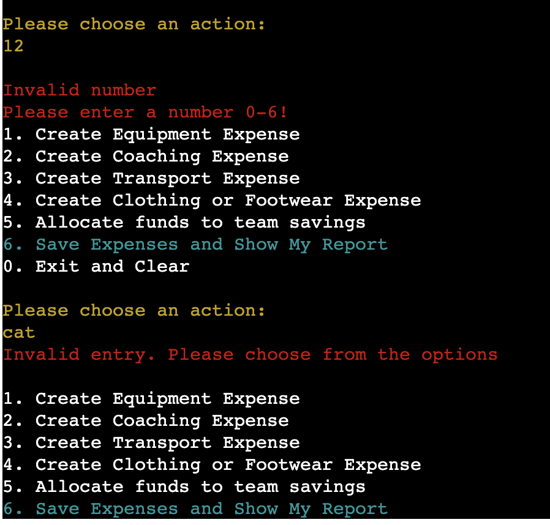

- To do this validation, I used a Try/Except block for the ‘choices’ input. I set the ‘choices’ input as an integer and set the else block to display the error message if anything other than an integer is entered by the user. 
    - The 'Else' statement checks if an integer entered is between 0-6. If not, it rasies an error message to the user. 
    - The 'Except' block rasies a ValueError if the user enters anything else, e.g. a letter, word, character, or nothing. 

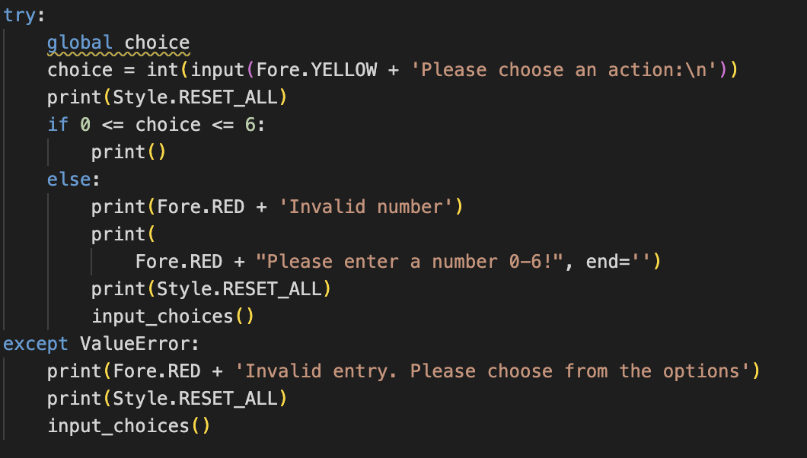

- Once a valid number is entered, the relevant function is called to proceed to the next step depending on the input chosen by the user.

#### Enter Name of Expense/Savings Allocation
* Once the user has chosen a number 1-5, they will be presented with what they chose, plus a prompt to enter a name for the expense/ a reason for allocating funds to savings.
- If the user enters an invalid input, they are presented with the error message and the name input again. Once they have entered something the program will proceed with the next steps. 
- This input does not accept an empty input, and if the user just presses enter, an error message shows asking to assign an expense name.
- For this input, I made the decision to allow the user to enter anything of their choice. This is because this is a sports expense tracker, and many sports teams or individuals may need to add characters or numbers to their expenses. e.g. ’12 footballs’, ‘Team 2 Coach’, ’22/23 Court Hire’. This allows the user to enter something that they will understand and be useful for them.

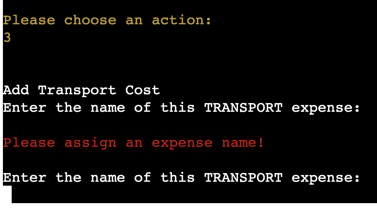

- To do this validation, I used an if statement to raise the error message for an empty string input. 

- Once a name is entered, the function is called to proceed to the next step of adding an expense or savings price. 

#### Price Inputs

- Once the user has entered a name of expense/reason for savings allocation, they are prompted to enter a price. 
- This input only accepts integers or floats >= 1. So the minimum amount it is possible for a single expense/saving is 1 pound/euro/dollar etc. 
- This input accepts numbers with decimal places of any number e.g. 3.45555. If a user enters a float with 3 or more decimal places, the price will automatically be rounded to 2 decimal places in the expense report when shown, to conform with price syntax. 
- If an invalid input is entered, the user is presented with the error message asking for a number, and the price input again. 
- This input does not accept anything that is not an integer or a float. Testing for this included inputting type errors for a number e.g. 8..22, as well as letters, characters, and empty spaces.

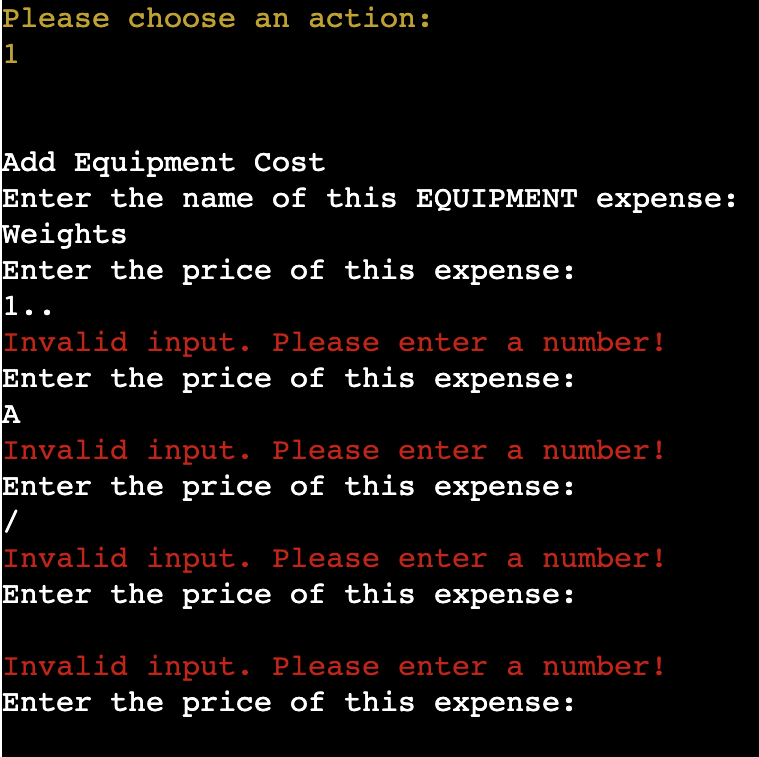

- To achieve this validation, I utilised the an If statement and the **Re module** to search for integers and floats within a certain range:

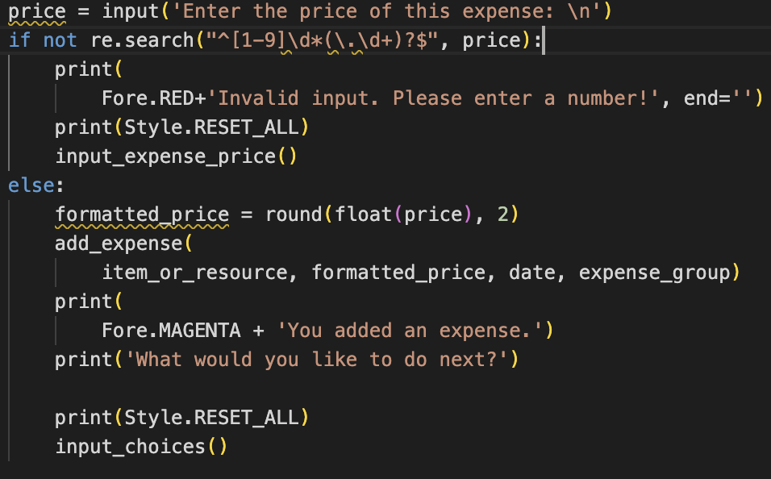

- Once a valid price is input, a message is shown to the user saying they have added an expense/saving fund, and to choose another action. 


### Bugs and Fixes 

- There are no unfixed bugs in the deployed app. 
- Throughout creation, the ```global``` keyword had to be added to some variables so that they could be accessed via each individual step and change depending on user input. 

### Code Testing & Validation
I used the [Code Institute Python Linter](https://pep8ci.herokuapp.com/#) to validate the code, checking for errors, and warning messages.
- Code was edited according to errors/warnings shown from the validator e.g. removing whitespace, editing indentation, and removing unused imports. 

## Known Constraints

**Expense Name**
- For the name of an expense or savings allocation, the user is not able to proceed without entering something into the input. However, if they are to press the spacebar any number of times in this input and press enter, the program proceeds. I have left this in conjunction with my logic that the user is able to enter whatever they wish for the name of an expense, and putting in a blank space in this way is a deliberate action by the user rather than just pressing enter. 
- This is in line with user feedback and real-world examples, where sports teams and individuals may add expenses or allocate funds to savings under whatever reason they choose, and there may be miscellaneous expenses. 

<hr>

## Deployment 

### Using GitHub & Gitpod 

To deploy this command-line interface application, I used the Code Institute Python Essentials Gitpod Template. Using this enables the program to run and be viewed on Heroku using a mock terminal in the browser. 

**Using the Template**
1. In the GitHub repository, click the ‘use this template’ button.
2. Add a repostiory name for your project.
3. Click Create Repository from Template to create a new repository using this template. 
4. Once this has been done, in the new GitHub repository, click the Gitpod button to open the workspace. 

- Committing work should be something done often. These actions should have clear, concise and explanatory messages, using the following commands in the terminal in Gitpod:
- ```git add . ```
- ``` git commit -m ‘Your commit message’ ``` - this commits changes to a local repository
- ```git push``` - pushes all committed changes made in the previous step to the GitHub repository. 

*Forking the GitHub Repository* 

Forks are used to propose changes to someone else’s project or to use someone else’s project as a starting point for your own idea. By forking a GitHub repository you are making a copy of the original repository and can make changes to it without affecting the original repository. 
1. Find GitHub repository you wish to clone
2. In the top right corner of the page, click the ‘Fork’ button 
3. You will now have a ‘Forked’ version of a repository which is a copy of the original to work on. 

*Cloning the GitHub Repository*

Cloning a repository will allow you to download a local version of it to be worked on. This can be done by:
Find the GitHub repository. 
1. Press the arrow on the ‘code’ button. 
2. Copy the link shown in the drop-down menu.
3. Open Gitpod and select the directory location where you would like to clone to be created and stored. 
4. In the terminal type ‘git clone’ and paste the GitHub repository link. 


### Creating an Application with Heroku 

To deploy this application in Heroku I followed the steps from the Code Institute Tutorial:

1. Insert the following command in the Gitpod terminal: pip3 freeze > requirements.txt - this will install your project dependencies so Heroku can read them. 
2. Go to Heroku.com and log in or create an account if you do not already have one. 
3. Click the New dropdown in the Heroku dashboard & select Create New App
4. Enter a name for your project. Note: all apps in Heroku must have a unique name, and Heroku will prompt you if you need to change it. 
5. Select your region (US/Europe)

*Heroku Settings:*
You will need to set Environment Variables in Heroku. This is necessary for deployment. 
* In the settings tab in Heroku, click on Reveal Config Vars and set the following variables:
    - Add key: PORT & value: 8000 
    - If your project is using credentials, you will need to add the credentials as a variable. Key: CREDS, value: paste contents of project creds JSON. 
* Buildpacks are also required for deployment. For this project, Python & Node.js were added (in this order). 

*Heroku Deployment in the Deploy tab:* 
1. Connect your Heroku Account to the specific GitHub repository for the project:
    - Click on the ```Deploy``` tab in Heroku and choose ```GitHub-Connect to GitHub```.
    - Enter the GitHub repository name and click ```search``` to find the match.
    - Choose the correct repository for the application and click ```Connect```.
2. You can either elect to deploy a project manually or automatically. Automatic deployment will generate a new application every time you push to GitHub from the Gitpod workspace, whereas manual deployment requires you to click the ‘Deploy Branch’ button on Heroku whenever changes in the workspace are made. 
3. Once you have chosen a deployment method, and clicked Deploy Branch, Heroku will start building you app. Once this is complete you will see a ```View``` button. Click this to open your application in the browser. 

<hr>

## Credits 

### Code 

- Inspiration for some parts of the code and using a Pandas data frame were taken from the [Computer Science Youtube Channel](https://www.youtube.com/@ComputerSciencecompsci112358). This has also been signalled in comments within relevant parts of the code. 
- [Chat GPT](https://chat.openai.com/chat)
    - Inspiration for utilisation of the Re module was taken from ChatGPT to help me find a way to validate my inputs. 
- [Stack Overflow](https://stackoverflow.com/)
    - help with understanding how to use a Try/Except Block effectively. 
- [W3C Schools](https://www.w3schools.com/python/default.asp)
    - Help with understanding some Python concepts.
- [PyPi](https://pypi.org/project/colorama/) - Instructions on how to use colorama taken from the PyPI Website. 


### Content

- Inspiration for the initial concept of this program came from the [DataQuest Website](https://www.dataquest.io/blog/python-projects-for-beginners/). However, the decision to make it specific for a sports team or individual is my own idea and adaptation. 

### Acknowledgements 
I would like to thank my mentor Harry Dhillon for his support throughout the course of this project, as well as my peers at Code Institute for their support and feedback. 


